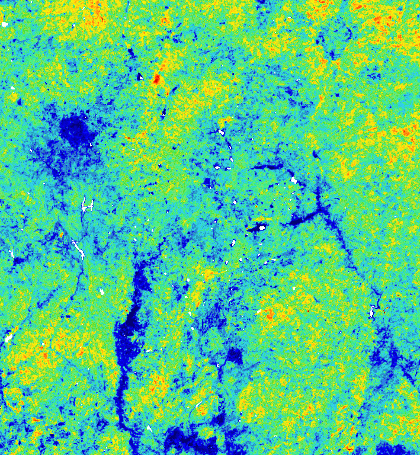
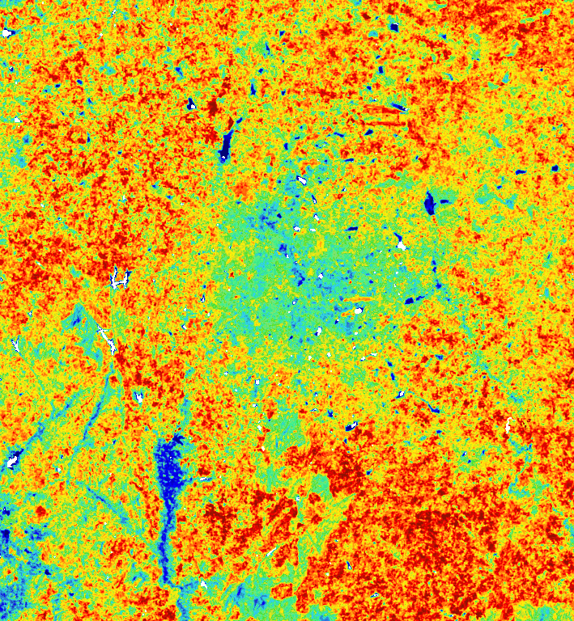
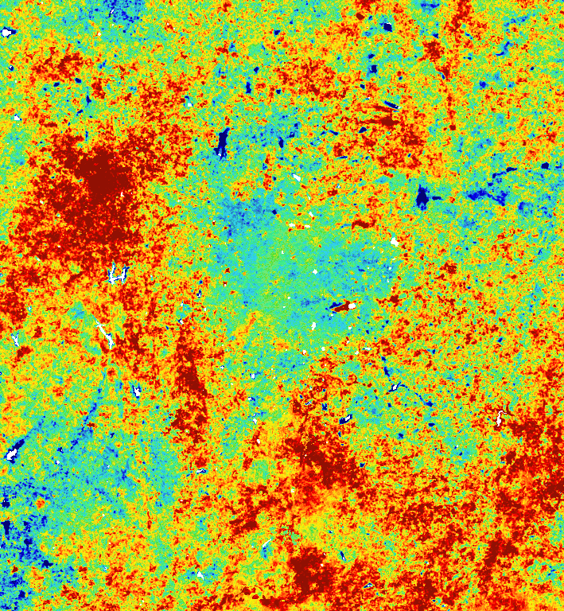
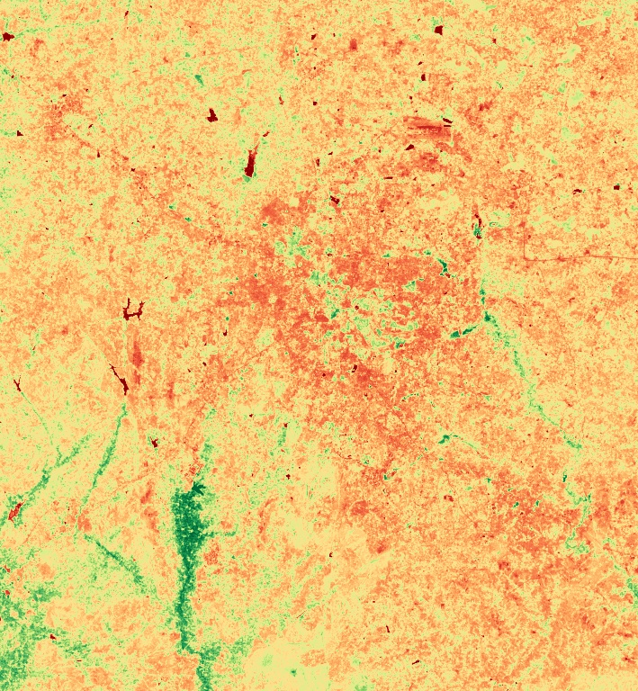

# Bangalore Urban Heat Island — Comparative LST Analysis (2015 vs 2024)

**Author:** generated via the `earth-engine` MCP server (Claude Code session, 2026-05-29)
**EE project:** `ee-madhulikasmriti`
**Code reference:** [server.py](../server.py) — `run_ee_code` calls; recomputable from the snippets below.

---

## 1. Headline findings

| Metric (Mar–May median) | 2015 | 2024 | Δ |
|---|---:|---:|---:|
| Mean LST — city (°C) | **38.12** | **42.02** | **+3.89** |
| Mean LST — rural ring (°C) | 38.39 | 43.46 | +5.07 |
| **Surface UHI** (ΔLST = city − rural) | **−0.27 °C** | **−1.44 °C** | −1.17 °C |
| Mean NDVI — city | 0.371 | 0.301 | −0.069 |
| Mean NDVI — rural ring | 0.393 | 0.329 | −0.064 |
| Mean NDBI — city | 0.014 | 0.038 | +0.024 |
| Mean NDBI — rural ring | 0.037 | 0.065 | +0.028 |
| **LST ↔ NDVI Pearson r (2024, full AOI)** | — | **−0.41** (p ≈ 0) | — |

**Three things to take away:**

1. **Daytime surface LST rose ~4–5 °C in nine years** in both the city and its peri-urban ring. This is a substantial warming signal even after accounting for inter-annual variability.
2. **The Surface UHI is *negative* during pre-monsoon** — i.e., daytime urban LST is *lower* than the surrounding rural ring. This is the well-documented "cool urban island" pattern of semi-arid South Indian cities in the dry season: bare/fallow rural land heats faster than the canopied, partially irrigated city core. The gap **widened from −0.27 °C (2015) to −1.44 °C (2024)** — rural warming has outpaced urban warming.
3. **Vegetation is the dominant cooling factor.** A pixel-level Pearson correlation of **r = −0.41** between LST and NDVI (2024, 90 m sample, p ≈ 0) means greener pixels are systematically cooler. NDVI declined ~17 % in both zones over the period, and NDBI rose, confirming continued vegetation loss and built-up densification.

> ⚠️ **Daytime ≠ Nighttime.** Landsat passes Bangalore around 10:30 IST. The classic "positive UHI" from nocturnal heat retention by concrete is not captured here. A complete UHI study should pair this daytime Landsat analysis with **MODIS MYD11A1 nighttime LST** (1 km, daily) to characterise the diurnal flip.

---

## 2. Why Sentinel-2 alone can't measure LST

Sentinel-2 (MSI) is a 13-band VNIR–SWIR sensor and **carries no thermal infrared band**. It cannot retrieve surface temperature. For LST in this study we used **Landsat 8/9 Collection 2 Level-2 (`ST_B10`)**, which is a pre-validated single-channel Surface Temperature product (~30 m, 16-day revisit per satellite, 8-day combined). Sentinel-2 is appropriate as an *urban context* layer (NDVI/NDBI) but only adds value at 10 m where comparison with 30 m Landsat data is required. To keep the inter-year comparison apples-to-apples we sourced NDVI and NDBI from Landsat for both years.

Alternative LST sources for follow-up work:

- **MODIS MOD11A2 / MYD11A2** — 1 km, 8-day composites; lower spatial resolution but day + night.
- **ECOSTRESS** (ISS) — ~70 m, irregular revisit, day + night.
- **Sentinel-3 SLSTR** — 1 km thermal, twice-daily revisit.

---

## 3. Methodology

### Area of interest

- **Urban core:** `FAO/GAUL/2015/level2 → ADM2_NAME == 'Bangalore Urban'` — district polygon (~2,187 km²).
- **Rural reference ring:** 15 km outward buffer of the urban polygon, with the urban polygon subtracted, giving an annular zone of ~3,719 km².
- **Water mask:** `JRC/GSW1_4/GlobalSurfaceWater`. Pixels with water occurrence ≥ 50 % are masked out so reservoirs/lakes don't bias the rural and urban LST stats downward.

### Sensors & products

| Use | Collection | Notes |
|---|---|---|
| Surface temperature | `LANDSAT/LC08/C02/T1_L2` (2015 & 2024) + `LC09` (2024) | Band `ST_B10`. Conversion: `K = DN · 0.00341802 + 149.0`; °C = K − 273.15. |
| Surface reflectance for NDVI/NDBI | Same collections | DN scaled by 2.75 × 10⁻⁵ − 0.2 per Collection 2 L2 spec. |
| Water mask | `JRC/GSW1_4/GlobalSurfaceWater` (`occurrence` band) | Permanent water suppressed in stats. |

### Filtering

- **Temporal window:** 1 March – 31 May (pre-monsoon dry season — strongest UHI contrast).
- **Cloud filter:** scene-level `CLOUD_COVER < 40 %`.
- **Per-pixel QA:** Landsat `QA_PIXEL` bits 3 (cloud) and 4 (cloud shadow) → masked.

### Aggregation

- Per-scene LST and indices → **median composite** per year.
- Zonal statistics over city and rural geometries with `reduceRegion`, `scale = 30 m`, `maxPixels = 1e10`, `bestEffort=True`.

### Scene counts

| Year | Landsat 8 | Landsat 9 | Sentinel-2 SR* |
|---|---:|---:|---:|
| 2015 (Mar–May) | 5 | — | — |
| 2024 (Mar–May) | 4 | 5 | 34 |

*S2 SR was used only to confirm availability for follow-up work; it does not enter the LST/NDVI/NDBI numbers reported here.

### Definitions

- **NDVI** = (NIR − Red) / (NIR + Red) — Landsat bands SR_B5 and SR_B4.
- **NDBI** = (SWIR1 − NIR) / (SWIR1 + NIR) — Landsat bands SR_B6 and SR_B5.
- **Surface UHI (ΔLST_SUHI)** = mean LST(city) − mean LST(rural 15 km ring).

---

## 4. Detailed statistics

### LST per zone (°C)

| Year | Zone | Mean | Std | p10 | p90 |
|---|---|---:|---:|---:|---:|
| 2015 | City | 38.12 | 2.36 | 35.13 | 41.12 |
| 2015 | Rural | 38.39 | 2.62 | 34.88 | 41.62 |
| 2024 | City | 42.02 | 3.06 | 38.31 | 45.94 |
| 2024 | Rural | 43.46 | 2.98 | 39.88 | 47.12 |

Standard deviations grew between 2015 and 2024 (city: 2.36 → 3.06; rural: 2.62 → 2.98), indicating an increase in within-zone **thermal heterogeneity** — hot patches got hotter relative to the mean. This is consistent with patchy intensification of impervious cover.

### NDVI & NDBI per zone

| Index | Year | City mean | Rural mean |
|---|---|---:|---:|
| NDVI | 2015 | 0.371 | 0.393 |
| NDVI | 2024 | 0.301 | 0.329 |
| NDBI | 2015 | 0.014 | 0.037 |
| NDBI | 2024 | 0.038 | 0.065 |

NDBI rose more in the rural buffer (+0.028) than in the city (+0.024), confirming the well-known **peri-urban sprawl** of Bangalore: the city's built-up belt has grown faster *outside* the administrative boundary than *inside* it.

### LST ↔ NDVI relationship (2024)

- **Pearson r = −0.41**, p ≈ 0, sampled at 90 m resolution across the full AOI.
- Interpretation: a one-unit drop in NDVI corresponds, on average, to a multi-°C rise in surface temperature. The 41 % shared variance is in the typical range reported for tropical/sub-tropical cities. Vegetation retention and restoration are therefore measurable UHI-mitigation levers.

---

## 5. Maps

> Render at 768 px wide, 30 m source resolution, water masked. Colour scales are matched between years for fair visual comparison.

**Land Surface Temperature, March–May 2015** (°C; blue 30 → red 50)


**Land Surface Temperature, March–May 2024** (°C; same scale)


**ΔLST (2024 minus 2015)** (°C; blue −5 → red +10) — almost the entire region warmed; the eastern and northern peri-urban belts (Whitefield, Sarjapur, Devanahalli direction) warmed the most.


**NDVI 2024** (0 → 0.8; red bare → dark green dense vegetation) — the urban core's tree canopy (Cubbon Park, Lalbagh, residential greenery) and surviving rural patches stand out against the warming sprawl.


---

## 6. Discussion: what's happening, in plain terms

1. **The city is warming, but its rural surroundings are warming faster.** Between 2015 and 2024 the rural ring's mean Mar–May LST rose by ~5.1 °C versus ~3.9 °C in the city. The city's existing canopy and water bodies (Bellandur, Ulsoor, Hesaraghatta, lake remnants) have buffered some of the warming, while the peri-urban belt — converting from agriculture and scrub to roads, warehouses, layouts, and IT campuses — has lost that buffer.
2. **The "Garden City" effect, weakened but still present.** A negative Surface UHI in pre-monsoon means urban surface temperatures are *below* rural ones during the day. This is driven by the residual urban tree canopy, irrigated parks, deep building shadows, and the thermal lag of concrete (which heats more slowly than dry bare soil during the morning Landsat overpass). The −0.27 → −1.44 °C deepening of this gap reflects rural warming more than urban cooling.
3. **NDVI loss is a measurable UHI driver.** A pixel-level r = −0.41 between LST and NDVI is strong enough to act on. Targeted re-greening — street trees, park expansion, lake catchment restoration — would be expected to deliver measurable surface cooling.
4. **Caveat — daytime only.** Concrete-dominated nights tell a different story: built-up areas re-radiate stored heat slowly and produce a *positive* nighttime UHI. Bangalore residents experience the heat-island effect mostly at night; this report does not characterise that side of the diurnal cycle.

---

## 7. Limitations

- **Median composites blur intra-period heatwaves.** A single hot week in April will not stand out in a 3-month median. For event-level analysis, switch to per-scene LST extraction.
- **Administrative city boundary, not built-up extent.** The GAUL polygon for "Bangalore Urban" includes some peri-urban land; conversely it excludes Whitefield/Sarjapur. A more rigorous follow-up would intersect with WorldPop ≥ X density or DLR's World Settlement Footprint.
- **Single-channel ST_B10 uncertainty.** Collection 2 L2 surface temperature has typical RMSE of 1.5–2.5 °C for vegetation, larger over heterogeneous urban surfaces and bare ground. Treat absolute LST values as accurate to ±2 °C; ΔLST between zones / years is more robust because biases cancel.
- **No emissivity adjustment per land cover.** The product uses ASTER GED emissivity, which can underrepresent urban materials.
- **Sentinel-2 SR not used in 2015 (S2 L2A coverage of India was sparse pre-2017).** Hence Landsat-only for NDVI/NDBI to keep the comparison apples-to-apples.

---

## 8. Reproducing this analysis

All numbers above came from `run_ee_code` calls through the `earth-engine` MCP server. The end-to-end snippet (paste into a Python session with `ee` initialised, or into the MCP runner):

```python
import ee
ee.Initialize(project='ee-madhulikasmriti')

city = ee.Feature(
    ee.FeatureCollection('FAO/GAUL/2015/level2')
      .filter(ee.Filter.eq('ADM2_NAME', 'Bangalore Urban')).first()
).geometry()
rural = city.buffer(15000).difference(city, 1)
water_mask = ee.Image('JRC/GSW1_4/GlobalSurfaceWater').select('occurrence').unmask(0).lt(50)

def lst_coll(cid, start, end):
    coll = (ee.ImageCollection(cid)
            .filterBounds(city.buffer(20000)).filterDate(start, end)
            .filter(ee.Filter.lt('CLOUD_COVER', 40)))
    def to_c(img):
        lst = img.select('ST_B10').multiply(0.00341802).add(149.0).subtract(273.15).rename('LST')
        qa = img.select('QA_PIXEL')
        return lst.updateMask(qa.bitwiseAnd(1<<3).eq(0)).updateMask(qa.bitwiseAnd(1<<4).eq(0))
    return coll.map(to_c)

lst15 = lst_coll('LANDSAT/LC08/C02/T1_L2', '2015-03-01', '2015-06-01').median().updateMask(water_mask)
lst24 = lst_coll('LANDSAT/LC08/C02/T1_L2', '2024-03-01', '2024-06-01').merge(
        lst_coll('LANDSAT/LC09/C02/T1_L2', '2024-03-01', '2024-06-01')).median().updateMask(water_mask)

def m(img, geom):
    return img.reduceRegion(reducer=ee.Reducer.mean(), geometry=geom,
                            scale=30, maxPixels=1e10, bestEffort=True).getInfo()
print('city 2015:', m(lst15, city), 'rural 2015:', m(lst15, rural))
print('city 2024:', m(lst24, city), 'rural 2024:', m(lst24, rural))
```

---

## 9. Suggested next steps

- **Nighttime UHI:** repeat with MODIS `MODIS/061/MYD11A1` `LST_Night_1km` over the same Mar–May windows to characterise the diurnal flip and the *true* heat-stress UHI.
- **Annual time series:** extend to 2015–2024 yearly to test whether the 2024 number is a peak or part of a monotonic trend.
- **Cooling cost of NDVI loss:** fit `LST = a + b·NDVI + c·NDBI` per year and interpret `b` as °C-per-NDVI cooling sensitivity. Use that to estimate the LST impact of a target-canopy intervention.
- **Ward-level heat map:** intersect ΔLST with BBMP ward polygons to rank wards by warming for prioritised intervention.
- **Sentinel-2 10 m NDVI overlay for 2024**, to capture canopy details (street trees, layout interiors) below the 30 m Landsat scale.

Each of these is a small extension — most are 20–40 lines via the MCP server's `run_ee_code` tool or the existing `compute_index` / `export_image_to_drive` tools.
